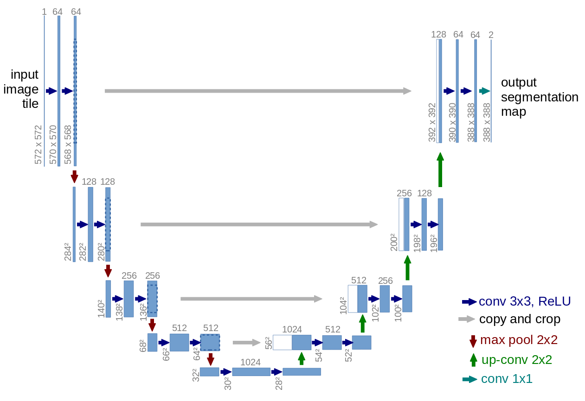
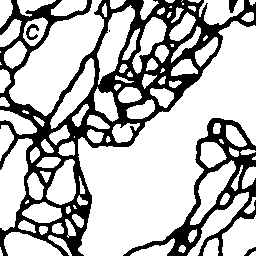

# unet
unet主要用于语义分割， 这里是一个细胞边缘检测的例子， 数据集比较简单， 是三张tif动图。
unet的网络结构， 因像字母‘U’而得名。

这里有一篇关于unet的 [论文](U-Net: Convolutional Networks for Biomedical Image Segmentation)， 论文里面的网络结构如下：


说一下这个网络：
输入572×572×1, 输出：388×388×2, 大小不一样。
主要是因为卷积的过程中， 每次卷积会减小， 在copy and crop中， 也会减小。

我这里设计的网络， 并没有像上图的网络一样， 原封不动的实现出来， 而是借助vgg网络结构来实现的。

看上图， 我们发现， unet的前半部分采用2层卷积+一层池化的设计方式， 这一点和vgg16的前半部分很相似， 因此， 我在实现的过程中， 采用了vgg16的前10层。
## 网络设计
```
def vgg10_unet(self, input_shape=(256,256,3), weights='imagenet'):
        vgg16_model = VGG16(input_shape=input_shape, weights=weights, include_top=False)

        block4_pool = vgg16_model.get_layer('block4_pool').output
        block5_conv1 =  Conv2D(1024, 3, activation='relu', padding='same', kernel_initializer='he_normal')(block4_pool)
        block5_conv2 =  Conv2D(1024, 3, activation='relu', padding='same', kernel_initializer='he_normal')(block5_conv1)
        block5_drop = Dropout(0.5)(block5_conv2)

        block6_up = Conv2D(512, 2, activation='relu', padding='same', kernel_initializer='he_normal')(
            UpSampling2D(size=(2, 2))(block5_drop))
        block6_merge = Concatenate(axis=3)([vgg16_model.get_layer('block4_conv3').output, block6_up])
        block6_conv1 = Conv2D(512, 3, activation='relu', padding='same', kernel_initializer='he_normal')(block6_merge)
        block6_conv2 = Conv2D(512, 3, activation='relu', padding='same', kernel_initializer='he_normal')(block6_conv1)
        block6_conv3 = Conv2D(512, 3, activation='relu', padding='same', kernel_initializer='he_normal')(block6_conv2)


        block7_up = Conv2D(256, 2, activation='relu', padding='same', kernel_initializer='he_normal')(
            UpSampling2D(size=(2, 2))(block6_conv3))
        block7_merge = Concatenate(axis=3)([vgg16_model.get_layer('block3_conv3').output, block7_up])
        block7_conv1 = Conv2D(256, 3, activation='relu', padding='same', kernel_initializer='he_normal')(block7_merge)
        block7_conv2 = Conv2D(256, 3, activation='relu', padding='same', kernel_initializer='he_normal')(block7_conv1)
        block7_conv3 = Conv2D(256, 3, activation='relu', padding='same', kernel_initializer='he_normal')(block7_conv2)


        block8_up = Conv2D(128, 2, activation='relu', padding='same', kernel_initializer='he_normal')(
            UpSampling2D(size=(2, 2))(block7_conv3))
        block8_merge = Concatenate(axis=3)([vgg16_model.get_layer('block2_conv2').output, block8_up])
        block8_conv1 = Conv2D(128, 3, activation='relu', padding='same', kernel_initializer='he_normal')(block8_merge)
        block8_conv2 = Conv2D(128, 3, activation='relu', padding='same', kernel_initializer='he_normal')(block8_conv1)

        block9_up = Conv2D(64, 2, activation='relu', padding='same', kernel_initializer='he_normal')(
            UpSampling2D(size=(2, 2))(block8_conv2))
        block9_merge = Concatenate(axis=3)([vgg16_model.get_layer('block1_conv2').output, block9_up])
        block9_conv1 = Conv2D(64, 3, activation='relu', padding='same', kernel_initializer='he_normal')(block9_merge)
        block9_conv2 = Conv2D(64, 3, activation='relu', padding='same', kernel_initializer='he_normal')(block9_conv1)

        block10_conv1 = Conv2D(64, 3, activation='relu', padding='same', kernel_initializer='he_normal')(block9_conv2)
        block10_conv2 = Conv2D(2, 1, activation='sigmoid')(block10_conv1)

        model = Model(inputs=vgg16_model.input, outputs=block10_conv2)
        return model
```
这样设计的好处就是， 我们前半部分采用了vgg网络可以使我们在训练网络的时候， 前半部分的权重， 我们可以加载vgg的预训练模型的权重来进行初始化， 当然， 你也可以在训练的时候， 冻结这几层网络， 只训练后半部分。
## 测试结果


